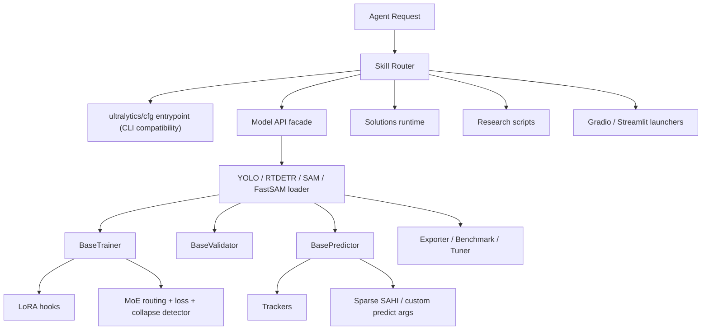

# YOLO-Master Agent Skill Specification

## 1. Purpose

本文件面向智能代理, 用于说明当前仓库的技术架构、CLI 与 Python API 的关系、能力技能化可行性, 以及建议的 Skill 设计、接口规范、调用示例与执行逻辑。

结论先行:

1. 当前项目适合被系统性技能化, 尤其是主干能力 `train / val / predict / track / export / benchmark / tune`。
2. 最佳实现路径是先将当前仓库以 Ultralytics 方式安装, 暴露 `yolo` CLI, 然后以 CLI 为主、Python API 为补充层、脚本为扩展层。
3. 主干框架能力可达到接近完整技能化; 少数交互式 UI、带硬编码路径的研究脚本、以及依赖外部环境的命令需要额外封装后才适合稳定交给代理。

---

## 2. Source of Truth

以下文件是本项目的能力真源, 代理做任何包装都应优先对齐这些文件:

- CLI 入口: `ultralytics/cfg/__init__.py`
- 统一模型门面: `ultralytics/engine/model.py`
- YOLO 任务映射: `ultralytics/models/yolo/model.py`
- 训练引擎: `ultralytics/engine/trainer.py`
- 验证引擎: `ultralytics/engine/validator.py`
- 推理引擎: `ultralytics/engine/predictor.py`
- 解决方案集合: `ultralytics/solutions/__init__.py`
- MoE 分析: `ultralytics/nn/modules/moe/analysis.py`
- MoE 裁剪: `ultralytics/nn/modules/moe/pruning.py`
- Gradio WebUI: `app.py`
- PEFT 对比脚本: `scripts/peft_validation/run_peft_compare.py`
- Sparse SAHI 对比脚本: `scripts/test_sahi_compare.py`

验证这些能力的测试入口主要在:

- `tests/test_cli.py`
- `tests/test_python.py`
- `tests/test_engine.py`
- `tests/test_exports.py`
- `tests/test_solutions.py`

这些测试文件可以直接视为 Skill 回归测试的候选基线。

---

## 3. Current Technical Architecture

### 3.1 Layered View



### 3.2 Core Runtime Path

当前主流程是一个非常典型的 "CLI 解析 -> 统一模型门面 -> 任务特定执行器" 架构:

1. `ultralytics/cfg/__init__.py:entrypoint()` 解析字符串参数。
2. 根据模型名自动选择 `YOLO / RTDETR / FastSAM / SAM`。
3. `ultralytics/engine/model.py` 提供统一方法:
   - `predict()`
   - `track()`
   - `val()`
   - `train()`
   - `export()`
   - `benchmark()`
   - `tune()`
   - `save_lora_only() / load_lora() / merge_lora()`
4. `ultralytics/models/yolo/model.py` 通过 `task_map` 将任务映射到不同的 `trainer / validator / predictor`。
5. 训练时 `BaseTrainer` 进一步注入 LoRA、MoE 监控、回调、日志和保存逻辑。

这意味着:

- CLI 不是能力真源, 但它是最适合代理稳定复用的标准执行面。
- 真实能力仍然存在于 Python API, 适合作为 CLI 未覆盖场景的回退层。
- 代理应优先确保 `yolo` CLI 可用, 然后默认走 CLI, 仅在 CLI 不覆盖场景下退回 Python API。

### 3.3 Capability Domains

当前项目的能力可分为 6 个域:

1. 核心训练推理域: `train / val / predict / track / export / benchmark / tune`
2. 模型管理域: `load / save / info / reset / fuse / class names / task map`
3. 系统运维域: `doctor / help / checks / version / settings / cfg / copy-cfg`
4. 视频方案域: `solutions`
5. 研究增强域: `LoRA / MoE diagnose / MoE prune / Sparse SAHI / PEFT compare`
6. 交互应用域: `Gradio app.py` 与 `Streamlit inference`

---

## 4. Feasibility Assessment

### 4.1 Overall Assessment

可以。并且不是勉强可做, 而是结构上已经接近现成。

原因有三点:

1. 主 CLI 只是薄封装, 与 `Model` 方法一一对应。
2. 训练、验证、推理、导出都已经使用统一的 `args + overrides + callback + save_dir` 模式。
3. 测试已经覆盖了 CLI、Python API、导出、Solutions 的大部分关键路径。

### 4.2 Readiness Matrix

| 能力组 | 当前入口 | 技能化状态 | 说明 |
|---|---|---:|---|
| 主 CLI 模式 | `yolo train/val/predict/track/export/benchmark` | Ready | 直接映射到 `Model` 方法 |
| 系统命令 | `doctor/help/checks/version/settings/cfg/copy-cfg` | Ready | 适合合并成一个管理类 Skill |
| 任务模型分发 | `YOLO.task_map` | Ready | 已具备稳定任务抽象 |
| Solutions | `yolo solutions ...` | Mostly Ready | 视频流与 UI 场景需要长任务封装 |
| LoRA 训练与适配器保存/加载/合并 | `train + save_lora_only/load_lora/merge_lora` | Ready | 建议独立 Skill 族 |
| MoE 诊断与裁剪 | `diagnose_model/prune_moe_model` | Mostly Ready | 现有脚本化接口可直接包, 但建议补结构化返回 |
| Gradio / Streamlit | `app.py`, `solutions/streamlit_inference.py` | Partially Ready | 更像 launcher skill, 不是纯函数 skill |
| PEFT 对比脚本 | `scripts/peft_validation/...` | Needs Refactor | 参数大量硬编码, 需先抽成函数化接口 |
| Sparse SAHI 对比脚本 | `scripts/test_sahi_compare.py` | Needs Refactor | 依赖可选模块与硬编码数据路径 |

### 4.3 Key Constraints

不是所有能力都应被建成独立 Skill。推荐原则:

1. 按 "模式" 建 Skill, 不按 "单条 CLI 语句" 建 Skill。
2. 用 `params` 透传保留全部 CLI 参数表面, 避免为每个 flag 建一个新 Skill。
3. 把交互式 UI 和长时任务定义为 launcher / async skill, 而不是同步函数。

---

## 5. Recommended Skillization Strategy

### 5.1 Primary Rule

代理必须优先安装并验证 `yolo` CLI, 默认调用 CLI, 不要跳过安装步骤直接散落调用底层 Python API。

推荐优先级:

1. CLI executor (`yolo ...`)
2. Python API executor
3. Module/function executor
4. Script executor

原因:

- `yolo` CLI 是 Ultralytics 对外最稳定的统一执行入口, 与用户心智和文档示例完全一致。
- 先通过 `python -m pip install -e .` 暴露 CLI, 可以让代理在当前仓库与标准 Ultralytics 用法之间保持一致。
- Python API 仍然适合做结构化补充, 例如读取返回对象、补充产物索引、处理 CLI 未覆盖的研究能力。
- 在 Apple Silicon 上, 训练、验证、评估类请求应优先落到 `mps`, 除非请求显式给出其他 `device`。
- 代理应先做环境 doctor, 自动确认 CLI 安装、repo 激活、设备可用性和数据引用状态, 再进入长任务。
- 若设备是自动推导出来的, 且 CLI 因 MPS/CUDA 运行时问题失败, 代理应自动回退一次到 CPU, 并把恢复轨迹结构化返回。

### 5.2 Five Executor Types

#### A. CLI Executor

用于绝大多数主干能力:

- `train`
- `val`
- `predict`
- `track`
- `export`
- `benchmark`
- `solutions`
- `doctor/help/checks/version/settings/cfg/copy-cfg`

典型调用:

```bash
yolo train model=... data=... epochs=...
```

这个执行器应作为默认首选, 并且在 CLI 缺失时先执行:

```bash
python -m pip install -e .
```

#### B. Python API Executor

用于:

- `tune`
- `save_lora_only`
- `load_lora`
- `merge_lora`
- `model inspect`
- CLI 尚未覆盖或不适合结构化抽取的能力

典型调用:

```python
from ultralytics import YOLO

model = YOLO(model_path, task=task)
result = model.train(**params)
```

它是 CLI 的补充层, 不是默认主执行面。

#### C. Module Executor

用于:

- `checks.collect_system_info`
- `handle_yolo_settings`
- `copy_default_cfg`
- `diagnose_model`
- `prune_moe_model`

#### D. Script Executor

用于:

- `scripts/peft_validation/run_peft_compare.py`
- `scripts/test_sahi_compare.py`

这类能力最好先重构出函数接口, 再由 Skill 调用函数。

#### E. Server Launcher Executor

用于:

- `python app.py`
- `streamlit run ultralytics/solutions/streamlit_inference.py`

返回值不应是模型指标, 而应是:

- `status`
- `pid`
- `url`
- `log_path`
- `ready_check`

---

## 6. Unified Skill Interface Contract

### 6.1 Request Envelope

所有 Skill 建议统一接收如下结构:

```json
{
  "skill": "yolo.train",
  "request_id": "exp-2026-05-12-001",
  "workspace_root": ".",
  "runtime": {
    "cwd": ".",
    "python": "python",
    "device": "mps",
    "prefer_mps": true,
    "prefer_cli": true,
    "prefer_python_api": false
  },
  "inputs": {
    "model": "ultralytics/cfg/models/master/v0_1/det/yolo-master-n.yaml",
    "task": "detect",
    "data": "coco8.yaml",
    "source": null
  },
  "params": {
    "epochs": 100,
    "imgsz": 640,
    "batch": 16,
    "save": true
  },
  "artifacts": {
    "project": "runs/agent",
    "name": "master-n-exp01"
  },
  "policy": {
    "dry_run": false,
    "async": false,
    "strict": true
  }
}
```

### 6.2 Response Envelope

```json
{
  "skill": "yolo.train",
  "status": "ok",
  "summary": "training finished",
  "job": {
    "mode": "sync",
    "save_dir": "/abs/path/to/runs/agent/master-n-exp01",
    "resume_supported": true
  },
  "metrics": {
    "metrics/mAP50-95(B)": 0.421,
    "fitness": 0.421
  },
  "evaluation": {
    "precision": 0.53,
    "recall": 0.44,
    "map50": 0.62,
    "map50_95": 0.41,
    "speed_ms": {
      "preprocess": 0.5,
      "inference": 12.8,
      "postprocess": 3.1
    }
  },
  "artifacts": [
    {
      "kind": "checkpoint",
      "path": "/abs/path/to/best.pt"
    },
    {
      "kind": "checkpoint",
      "path": "/abs/path/to/last.pt"
    },
    {
      "kind": "csv",
      "path": "/abs/path/to/results.csv"
    }
  ],
  "logs": {
    "stdout_path": "/abs/path/to/stdout.log",
    "stderr_path": "/abs/path/to/stderr.log"
  },
  "environment": {
    "devices": {
      "requested": "mps",
      "selected": "mps",
      "selection_source": "auto"
    }
  },
  "auto_completed": {
    "device": "mps",
    "device_source": "auto",
    "workers": 0
  },
  "recovery": {
    "attempted": false
  },
  "attempts": [],
  "recommendations": [
    "Use yolo.system doctor before long runs when the environment is uncertain."
  ],
  "next_actions": [
    "yolo.val",
    "yolo.export"
  ]
}
```

### 6.3 Required Status Values

- `ok`: 成功完成
- `running`: 已启动长任务
- `blocked`: 环境或依赖不满足
- `failed`: 运行失败
- `partial`: 部分完成, 但有结果可用

### 6.4 Artifact Rules

代理调用 Skill 时应强制输出结构化产物清单。建议产物类型:

- `checkpoint`
- `metrics`
- `json`
- `csv`
- `image`
- `video`
- `config`
- `adapter`
- `exported_model`
- `report`
- `server_url`

### 6.5 Param Pass-through Rule

为保留 CLI 全部能力, 每个 Skill 都必须接受 `params: {}` 透传到底层 API。这样可以:

- 不丢任何 Ultralytics/YOLO 参数
- 不需要在 Skill 层手工复制完整参数表
- 让新参数自动继承到 Skill

### 6.6 Device Selection Rule

为了让代理在 Apple Silicon 上稳定使用本机加速, 建议固定以下设备优先级:

1. `params.device`
2. `runtime.device`
3. 若 `runtime.prefer_mps=true` 且 `torch.backends.mps.is_available()`, 自动注入 `device=mps`
4. 否则保持 Ultralytics 默认行为

这样既能满足显式控制, 又能让 `yolo-master-agent` 在未指定设备时自然走 MPS 训练、验证与评估。

当设备来源是自动选择而不是用户显式指定时, 若 CLI 首次执行命中 `mps_runtime_error` 或 `cuda_runtime_error`, 代理应自动重试一次 `device=cpu`, 并返回:

- `recovery`: 说明回退是否触发、触发原因、源设备与目标设备
- `attempts`: 每次 CLI 尝试的命令、设备、返回码与错误摘要

### 6.7 Evaluation Summary Rule

当 `train` 或 `val` 走 CLI 执行时, 代理应同时返回:

- `metrics`: 原始指标字典
- `evaluation`: 归一化后的评估摘要, 便于 agent 直接比较不同 run

建议 `evaluation` 至少包含:

- `precision`
- `recall`
- `map50`
- `map50_95`
- `speed_ms`
- 对训练再额外带上 `train_*` 和 `val_*` 关键损失

### 6.8 Doctor Rule

`yolo.system doctor` 应作为代理的环境入口, 至少返回:

- Python 可执行文件与版本
- Ultralytics 模块路径与是否激活当前 repo
- `yolo` CLI 路径与安装状态
- Torch / CUDA / MPS 设备清单
- 模型、数据、source 引用的解析状态
- 设备选择来源, 以及面向 agent 的自适应建议列表

---

## 7. Skill Registry

### 7.1 Core Skills

| Skill ID | Scope | Underlying API | Async | CLI Coverage |
|---|---|---|---:|---|
| `yolo.system` | 系统检查、环境 doctor、版本、settings、cfg、copy-cfg | `cfg` 模块函数 | No | `doctor/help/checks/version/settings/cfg/copy-cfg` |
| `yolo.model.inspect` | 模型加载、info、names、fuse、reset、task 推断 | `YOLO` / `Model` | No | Python API fallback |
| `yolo.train` | 训练与恢复训练 | `Model.train()` | Yes | `yolo train ...` |
| `yolo.val` | 验证与 COCO JSON 评估 | `Model.val()` / validator | No | `yolo val ...` |
| `yolo.predict` | 单图/批量/目录/URL/流推理 | `Model.predict()` | Optional | `yolo predict ...` |
| `yolo.track` | 视频/流追踪 | `Model.track()` | Optional | `yolo track ...` |
| `yolo.export` | 导出各格式模型 | `Model.export()` | No | `yolo export ...` |
| `yolo.benchmark` | 导出格式对比与性能基准 | `Model.benchmark()` | Optional | `yolo benchmark ...` |
| `yolo.tune` | 超参搜索 | `Model.tune()` | Yes | Python API fallback |

### 7.2 Extension Skills

| Skill ID | Scope | Underlying API | Status |
|---|---|---|---|
| `yolo.lora.train` | 带 LoRA 训练 | `Model.train(lora_*=...)` | Ready |
| `yolo.lora.adapters` | 保存/加载/合并 LoRA 适配器 | `save_lora_only/load_lora/merge_lora` | Ready |
| `yolo.moe.diagnose` | 专家使用率诊断 | `diagnose_model()` | Mostly Ready |
| `yolo.moe.prune` | 专家裁剪 | `prune_moe_model()` | Mostly Ready |
| `yolo.solutions.run` | 视觉方案运行 | `solutions.*` | Mostly Ready |
| `yolo.ui.launch` | Gradio / Streamlit 启动 | `app.py` / `streamlit_inference.py` | Partially Ready |
| `yolo.eval.peft_compare` | PEFT 方案对比实验 | `scripts/peft_validation/*` | Needs Refactor |
| `yolo.eval.sparse_sahi_compare` | Sparse SAHI 对比 | `scripts/test_sahi_compare.py` | Needs Refactor |
| `yolo.pipeline.experiment` | 训练-验证-导出-评估全流程编排 | Orchestrator skill | Recommended |

---

## 8. Detailed Skill Definitions

### 8.1 `yolo.system`

**Intent**

统一承接轻量系统管理命令, 避免为 `help/checks/version/settings/cfg` 各建一个 Skill。

**Actions**

- `doctor`
- `help`
- `checks`
- `version`
- `settings.get`
- `settings.reset`
- `settings.update`
- `cfg.get`
- `cfg.copy`

**Inputs**

```json
{
  "skill": "yolo.system",
  "action": "checks",
  "params": {}
}
```

**Outputs**

- 文本结果
- 配置文件路径
- settings 更新结果
- doctor 模式下的环境报告与安装/设备解析结果

**Execution Logic**

1. 解析 `action`
2. 对 `doctor` 先做 CLI 安装自检与设备探测
3. 路由到 `cfg` 模块对应函数
4. 捕获 stdout/stderr
5. 结构化返回

**Example**

```json
{
  "skill": "yolo.system",
  "action": "settings.update",
  "params": {
    "wandb": false,
    "mlflow": false
  }
}
```

### 8.2 `yolo.model.inspect`

**Intent**

让代理在训练前自动识别模型任务类型、类名、设备约束、是否支持 PyTorch-only 功能。

**Inputs**

- `model`
- `task` optional
- `actions`: `info`, `names`, `device`, `task_map`, `fuse`, `reset_weights`

**Key Rule**

若模型不是 `.pt` 或 `.yaml/.yml` 对应的 PyTorch 模型, 则禁止代理对其调用:

- `train`
- `export`
- `benchmark`
- `tune`
- `save_lora_only`
- `load_lora`
- `merge_lora`
- `moe prune`

这个约束直接来自 `Model._check_is_pytorch_model()`。

**Example**

```json
{
  "skill": "yolo.model.inspect",
  "inputs": {
    "model": "yolo11n.onnx"
  },
  "params": {
    "actions": ["info", "task_map"]
  }
}
```

### 8.3 `yolo.train`

**Intent**

启动或恢复训练, 支持基础 YOLO、YOLO-Master、LoRA、MoE 参数透传。

**Underlying API**

`YOLO(model).train(**params)`

**Required Inputs**

- `model`
- `data`

**Optional Inputs**

- `task`
- `cfg`
- `resume`
- `project`
- `name`
- 任意训练参数透传到 `params`

**Outputs**

- `metrics`
- `save_dir`
- `best.pt`
- `last.pt`
- `results.csv`
- `args.yaml`

**Execution Logic**

1. 加载模型并推断任务。
2. 若 `pretrained` 是路径, 先执行 `model.load(...)`。
3. 合并 `cfg`、默认参数和 `params`。
4. 调用 `model.train(**args)`。
5. 收集 `trainer.best`, `trainer.last`, `trainer.validator.metrics`。
6. 返回下一步建议 `yolo.val` 或 `yolo.export`。

**Example**

```json
{
  "skill": "yolo.train",
  "inputs": {
    "model": "ultralytics/cfg/models/master/v0_1/det/yolo-master-n.yaml",
    "task": "detect",
    "data": "coco8.yaml"
  },
  "params": {
    "epochs": 50,
    "imgsz": 640,
    "batch": 16,
    "device": "mps",
    "project": "runs/agent",
    "name": "master-n-baseline"
  }
}
```

### 8.4 `yolo.val`

**Intent**

对训练后模型、预训练模型或导出模型进行验证。

**Underlying API**

`YOLO(model).val(**params)`

**Strength**

`val` 比 `train` 更通用。导出格式如 ONNX、TensorRT、OpenVINO 仍可走 `val`。

**Outputs**

- 指标对象
- `predictions.json` 可选
- confusion matrix 导出可选

**Execution Logic**

1. 自动识别模型格式。
2. 对导出模型走 `AutoBackend`。
3. 验证后提取 `metrics`, `speed`, `predictions.json`。

**Example**

```json
{
  "skill": "yolo.val",
  "inputs": {
    "model": "runs/agent/master-n-baseline/weights/best.pt",
    "data": "coco8.yaml"
  },
  "params": {
    "imgsz": 640,
    "save_json": true,
    "plots": true
  }
}
```

### 8.5 `yolo.predict`

**Intent**

执行单图、多图、目录、glob、URL、视频、流推理。

**Underlying API**

`YOLO(model).predict(source=..., **params)`

**Special Notes**

- 对代理最友好的输入是绝对路径、URL、numpy array 或图像对象。
- CLI 支持的来源类型几乎都能保留。
- 若 `stream=True`, 返回应设计为迭代式或异步式结果。

**Outputs**

- `Results[]`
- 预测可视化
- `labels/*.txt` 可选
- `crops/` 可选

**Example**

```json
{
  "skill": "yolo.predict",
  "inputs": {
    "model": "yolo_master_n.pt",
    "source": "assets/bus.jpg"
  },
  "params": {
    "conf": 0.25,
    "save": true,
    "save_txt": true,
    "visualize": false
  }
}
```

### 8.6 `yolo.track`

**Intent**

对视频或流执行追踪。

**Underlying API**

`YOLO(model).track(source=..., **params)`

**Important Runtime Rules**

- `track()` 内部会注册 tracker。
- 默认将 `conf` 下探到 `0.1`。
- 默认 `batch=1`。

**Outputs**

- 追踪结果
- 可保存视频/帧
- 对象 ID

**Example**

```json
{
  "skill": "yolo.track",
  "inputs": {
    "model": "yolo11n.pt",
    "source": "demo.mp4"
  },
  "params": {
    "tracker": "botsort.yaml",
    "save": true,
    "save_frames": true
  }
}
```

### 8.7 `yolo.export`

**Intent**

将 PyTorch 模型导出为部署格式。

**Underlying API**

`YOLO(model).export(format=..., **params)`

**Typical Formats**

- `torchscript`
- `onnx`
- `openvino`
- `engine`
- `coreml`
- `saved_model`
- `tflite`
- `ncnn`
- `mnn`
- `imx`

**Constraint**

必须是 PyTorch 模型。

**Outputs**

- 导出模型路径
- 导出日志

**Example**

```json
{
  "skill": "yolo.export",
  "inputs": {
    "model": "runs/agent/master-n-baseline/weights/best.pt"
  },
  "params": {
    "format": "onnx",
    "dynamic": true,
    "simplify": true,
    "imgsz": 640
  }
}
```

### 8.8 `yolo.benchmark`

**Intent**

比较不同导出格式的精度、速度与兼容性。

**Underlying API**

`YOLO(model).benchmark(data=..., format=..., **params)`

**Outputs**

- benchmark 结果表
- 每种导出格式的指标

**Example**

```json
{
  "skill": "yolo.benchmark",
  "inputs": {
    "model": "runs/agent/master-n-baseline/weights/best.pt",
    "data": "coco8.yaml"
  },
  "params": {
    "imgsz": 640,
    "device": "mps",
    "half": true
  }
}
```

### 8.9 `yolo.tune`

**Intent**

执行超参搜索。

**Underlying API**

`YOLO(model).tune(use_ray=..., iterations=..., **params)`

**Behavior**

- `use_ray=false` 时走内部 `Tuner`
- `use_ray=true` 时走 Ray Tune

**Agent Recommendation**

该 Skill 默认应设计为 async, 因为超参搜索天然长时。

### 8.10 `yolo.lora.train`

**Intent**

以 LoRA/DoRA/LoHa/IA3 等 PEFT 方式训练。

**Underlying API**

仍然是 `yolo.train`, 只是 `params` 中加入 LoRA 参数。

**Suggested Supported Params**

- `lora_r`
- `lora_alpha`
- `lora_dropout`
- `lora_backend`
- `lora_type`
- `lora_use_dora`
- `lora_gradient_checkpointing`

**Example**

```json
{
  "skill": "yolo.lora.train",
  "inputs": {
    "model": "yolo11s.pt",
    "data": "coco8.yaml"
  },
  "params": {
    "epochs": 50,
    "imgsz": 640,
    "batch": 16,
    "lora_r": 16,
    "lora_alpha": 32,
    "lora_dropout": 0.1,
    "lora_type": "lora"
  }
}
```

### 8.11 `yolo.lora.adapters`

**Intent**

对训练后的 LoRA 适配器执行保存、加载和合并。

**Actions**

- `save`
- `load`
- `merge`

**Underlying API**

- `model.save_lora_only(path)`
- `model.load_lora(path, merge=False)`
- `model.merge_lora()`

**Example**

```json
{
  "skill": "yolo.lora.adapters",
  "action": "save",
  "inputs": {
    "model": "runs/agent/lora-exp/weights/best.pt",
    "path": "runs/agent/lora-exp/adapter"
  }
}
```

### 8.12 `yolo.moe.diagnose`

**Intent**

分析 MoE 专家使用率、路由是否塌缩、输出热力图与统计图。

**Underlying API**

`diagnose_model(model_path, dataset, batch_size, verbose)`

**Current Limitation**

`diagnose_model()` 这条模块级路径本身仍偏脚本风格。当前限制只影响 MoE diagnose 封装, 不影响主 dispatcher 的 `train / val / predict / benchmark`, 后者在 Apple Silicon 上已经可默认解析到 `mps`。

**Outputs**

- usage report
- `expert_usage_heatmap.png`
- `expert_usage_bar.png`

**Example**

```json
{
  "skill": "yolo.moe.diagnose",
  "inputs": {
    "model": "runs/agent/master-moe/weights/best.pt",
    "data": "coco8.yaml"
  },
  "params": {
    "batch_size": 1,
    "verbose": false
  }
}
```

### 8.13 `yolo.moe.prune`

**Intent**

删除低利用率专家并重建路由输出维度。

**Underlying API**

`prune_moe_model(model_path, output_path, threshold, dataset)`

**Current Limitation**

与 `diagnose` 相同, 当前实现偏脚本风格, 建议 Skill 包装后额外返回:

- 保留专家清单
- 每层裁剪比例
- 裁剪前后验证结果

**Example**

```json
{
  "skill": "yolo.moe.prune",
  "inputs": {
    "model": "runs/agent/master-moe/weights/best.pt",
    "data": "coco8.yaml"
  },
  "params": {
    "threshold": 0.15,
    "output_path": "runs/agent/master-moe/pruned.pt"
  }
}
```

### 8.14 `yolo.solutions.run`

**Intent**

运行计数、热力图、区域队列、运动分析、实例分割等视频方案。

**Underlying API**

`ultralytics.solutions.*`

**Supported Solutions**

- `count`
- `crop`
- `blur`
- `workout`
- `heatmap`
- `isegment`
- `visioneye`
- `speed`
- `queue`
- `analytics`
- `inference`
- `trackzone`

**Design Suggestion**

不为每个 solution 单独建 Skill, 而是统一 Skill + `solution` 参数:

```json
{
  "skill": "yolo.solutions.run",
  "inputs": {
    "solution": "count",
    "model": "yolo11n.pt",
    "source": "demo.mp4"
  },
  "params": {
    "region": [[10, 200], [540, 200], [540, 180], [10, 180]],
    "show": false
  }
}
```

### 8.15 `yolo.ui.launch`

**Intent**

启动 Web UI, 供人类或外部代理通过浏览器使用。

**Modes**

- `gradio`
- `streamlit`

**Outputs**

- `status=running`
- `pid`
- `url`
- `stdout_path`
- `ready_check`

**Important Note**

这不是纯推理 Skill, 而是 server launcher skill。

### 8.16 `yolo.eval.peft_compare`

**Intent**

对不同 PEFT 变体做对比实验。

**Current Reality**

现有脚本具备研究价值, 但不适合作为通用 Skill 直接调用, 因为它硬编码了:

- `MODEL_PATH`
- `DATA_YAML`
- `DEVICE`
- `EPOCHS`
- `PROJECT_DIR`

**Required Refactor Before Production**

1. 提取为 `run_peft_compare(config: dict) -> dict`
2. 把模型、数据、设备、epoch、变体列表全部外置
3. 返回结构化结果而不是依赖 stdout

### 8.17 `yolo.eval.sparse_sahi_compare`

**Intent**

比较标准推理、完整 SAHI 和 Sparse SAHI。

**Current Reality**

该脚本仍存在两个阻塞点:

1. `SparseSAHIPredictor` 依赖可选模块, 缺失时只会降级打印 warning
2. 数据路径与模型路径带硬编码

因此它适合被列为 "待重构 Skill", 而不是立即纳入稳定执行面。

---

## 9. Agent Execution Logic

### 9.1 Global Algorithm

每个 Skill 都应遵循同一执行算法:

1. **Normalize**
   - 解析 `skill`, `inputs`, `params`, `policy`
   - 将相对路径规范化为工作区绝对路径

2. **Preflight**
   - 检查模型文件、数据配置、依赖包、设备可用性
   - 判断是否满足 PyTorch-only 约束
   - 对 launcher skill 检查端口占用
   - 若请求未显式指定 `device`, 在 Apple Silicon 上优先探测并选择 `mps`

3. **Executor Selection**
   - 若是主干能力, 先选 `yolo` CLI executor
   - 若是 `doctor/checks/settings/copy-cfg`, 选 module executor
   - 若是研究脚本, 选 script executor
   - 若是 UI, 选 server launcher executor

4. **Run**
   - 同步 Skill 直接等待结果
   - 长任务 Skill 以 async 模式启动并记录 `job manifest`

5. **Collect**
   - 收集 save_dir、metrics、模型产物、JSON、图片、视频
   - 生成统一 artifact 列表

6. **Verify**
   - 训练后确认 `best.pt/last.pt` 是否存在
   - 导出后确认导出文件是否存在并可加载
   - 诊断后确认图像是否生成

7. **Recommend Next Step**
   - `train -> val -> export -> benchmark`
   - `lora.train -> lora.adapters.save -> val`
   - `moe.diagnose -> moe.prune -> val`

### 9.1.1 Validation Tiering

为了让 Skill 的回归验证既稳定又能覆盖真实 CLI 行为, 建议固定使用以下分层:

- `fast-smoke`: 安装与 dry-run 规划路径
- `cli-smoke`: 真实 `yolo` CLI 轻量命令
- `deep-smoke`: 模型 inspect 与本地 `.pt` 预测
- `extended-cli`: 真实 mini-dataset `yolo val`, 默认标记为 `manual_only`
- manual train soak: 只保留为人工探针, 不纳入默认 AutoTrain

这样代理在日常自检时可以优先跑 `all` 或 `smoke`, 在需要更强把握时再显式触发 `extended-cli`。

### 9.2 Job Manifest

建议每次 Skill 执行都在保存目录写一个 `skill_manifest.json`, 至少包含:

```json
{
  "skill": "yolo.train",
  "request_id": "exp-001",
  "status": "ok",
  "save_dir": "/abs/path",
  "artifacts": [],
  "metrics": {},
  "created_at": "2026-05-12T00:00:00"
}
```

这会让代理能够:

- 断点恢复
- 自动发现上一步输出
- 在多阶段流水线中串接后续 Skill

---

## 10. Full-Process Orchestration

### 10.1 Recommended Orchestrator Skill

建议增加一个高层编排 Skill:

`yolo.pipeline.experiment`

它不是替代底层 Skill, 而是用于把底层 Skill 串起来:

1. 系统检查
2. 模型检查
3. 训练
4. 验证
5. 导出
6. 基准测试
7. 可选 LoRA/MoE 诊断
8. 汇总报告

### 10.2 Example Workflow

```json
{
  "skill": "yolo.pipeline.experiment",
  "inputs": {
    "model": "ultralytics/cfg/models/master/v0_1/det/yolo-master-n.yaml",
    "task": "detect",
    "data": "coco8.yaml"
  },
  "params": {
    "train": {
      "epochs": 100,
      "imgsz": 640,
      "batch": 16,
      "device": "mps"
    },
    "val": {
      "save_json": true
    },
    "export": {
      "format": "onnx",
      "dynamic": true
    },
    "benchmark": {
      "half": true
    }
  }
}
```

### 10.3 Orchestrator Output

应统一输出:

- `best_checkpoint`
- `val_metrics`
- `exported_models`
- `benchmark_summary`
- `report_path`

---

## 11. Implementation Roadmap

### Phase 1: Stable Core Wrappers

先封装这些 Ready 能力:

1. `yolo.system`
2. `yolo.model.inspect`
3. `yolo.train`
4. `yolo.val`
5. `yolo.predict`
6. `yolo.track`
7. `yolo.export`
8. `yolo.benchmark`
9. `yolo.tune`

### Phase 2: Research Extensions

随后封装:

1. `yolo.lora.train`
2. `yolo.lora.adapters`
3. `yolo.moe.diagnose`
4. `yolo.moe.prune`
5. `yolo.solutions.run`

### Phase 3: Launcher and Workflow Skills

最后增加:

1. `yolo.ui.launch`
2. `yolo.pipeline.experiment`
3. `yolo.report.summarize`

### Phase 4: Refactor Yellow Scripts

重构:

1. `scripts/peft_validation/run_peft_compare.py`
2. `scripts/test_sahi_compare.py`

目标是把它们从 "脚本" 变成 "可传参函数"。

---

## 12. What the Agent Should Do by Default

当代理基于本文件工作时, 默认行为应为:

1. 先用 `yolo.system` 做环境检查。
2. 再用 `yolo.model.inspect` 判断任务、模型格式和可用能力。
3. 主流程优先确保本仓库已安装为 Ultralytics CLI, 然后通过 `yolo` 执行主干命令。
4. 所有长时任务都写 `skill_manifest.json`。
5. 每个阶段都返回结构化 artifacts 和 next actions。
6. 训练、验证、评估流程串接时, 优先复用上一步 `save_dir` 中的真实产物。

---

## 13. Final Recommendation

如果目标是让 Claude 或其他智能代理真正稳定地驱动 YOLO-Master 全流程, 推荐的最终架构不是 "把 CLI 原样暴露出去", 而是:

1. **保留 CLI 作为兼容入口**
2. **以 `Model` API 作为 Skill 主执行面**
3. **以统一 request/response contract 作为代理协议**
4. **以 orchestrator skill 串起训练、验证、导出、评估**

在这个方案下, 当前框架的主干功能可以被完整技能化, 并足以支持模型训练、验证、评估与部署全流程。需要补工作的部分, 主要集中在交互式 UI 启动与少量研究脚本参数化, 而不在主框架本身。
